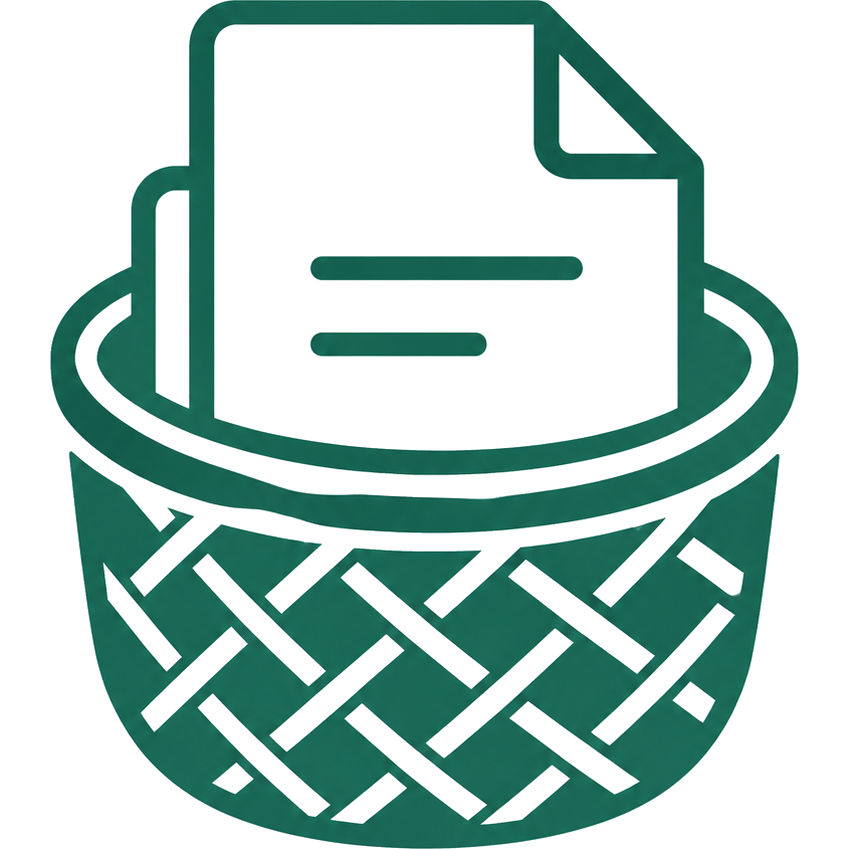
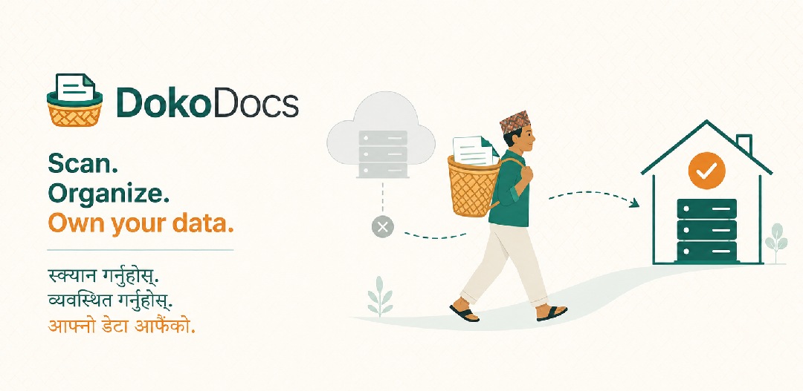
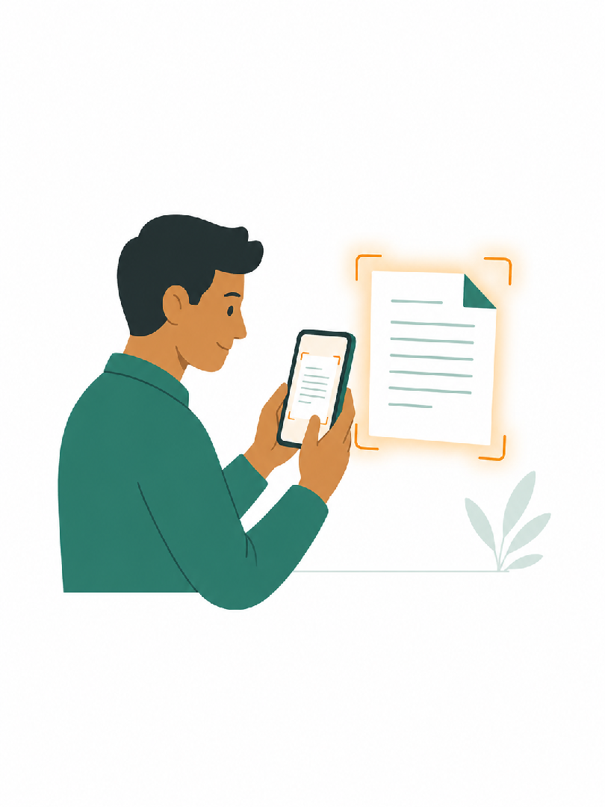
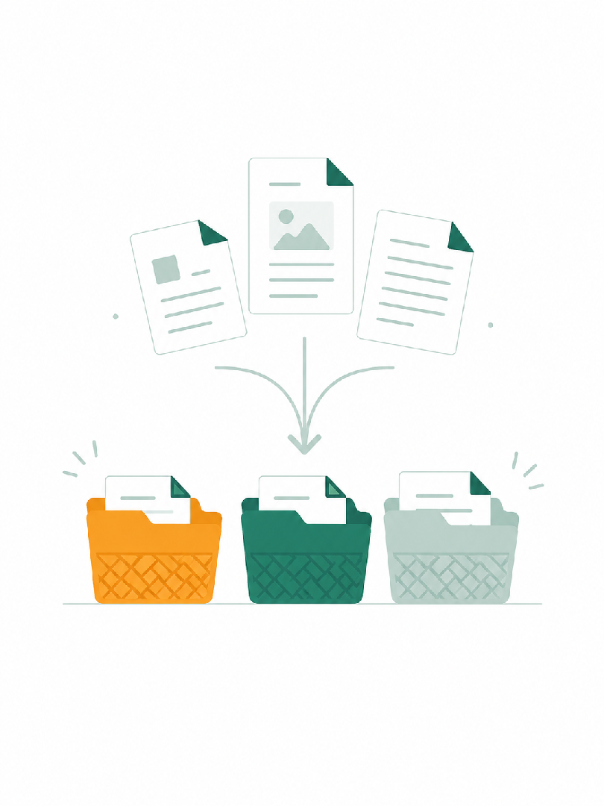

<div align="center">



# DokoDocs

**तपाईंको कागजात, तपाईंकै फोनमा — your documents, on your own phone.**

*Scan. Organize. Sync. Own Your Data.*

[](https://github.com/dokodocs/app/releases/latest)
[](https://dokodocs.com)
[](LICENSE)

[](https://flutter.dev)
[](docs/SCANNER_V3_POSTMORTEM.md)
[](#supported-devices--os-versions)
[](#supported-devices--os-versions)
[](https://github.com/dokodocs/app/stargazers)



</div>

---

DokoDocs is an open-source, self-hostable document scanner and PDF toolkit for iOS and Android — comparable to CamScanner / Adobe Scan / Microsoft Lens, but built around **data ownership**: your files live on your device by default, and any sync destination (your own server, your own LAN PC, or your own cloud account) is something *you* configure. DokoDocs never routes files through a proprietary company server you didn't choose.

## 📲 Download

**Android (signed APK):** grab the latest build from the [**Releases page**](https://github.com/dokodocs/app/releases/latest).

| Build | For | Direct link |
|---|---|---|
| `arm64-v8a` | Most phones from ~2016 onward (**recommended**) | [Download](https://github.com/dokodocs/app/releases/latest/download/DokoDocs-arm64-v8a.apk) |
| `armeabi-v7a` | Older / very low-end 32-bit phones | [Download](https://github.com/dokodocs/app/releases/latest/download/DokoDocs-armeabi-v7a.apk) |
| `x86_64` | Emulators / Chromebooks | [Download](https://github.com/dokodocs/app/releases/latest/download/DokoDocs-x86_64.apk) |

> On first install Android will ask you to allow "install from unknown sources" — that's normal for apps installed outside the Play Store. Google Play and App Store listings are coming with the Phase 1 launch gate ([`prompt/launch_app.md`](prompt/launch_app.md)).

**iOS:** App Store release is in progress; for now build from source (see [Getting started](#getting-started-once-flutter-is-installed--see-docsroadmapmd-step-0)).

## ✨ What it does

<div align="center">

| 📷 Scan | 🗂️ Organize | 🔒 Own |
|:---:|:---:|:---:|
|  |  |  |
| Live edge detection, one-tap capture, automatic crop & enhance → PDF | Folders, batch scans, version history, dual-calendar AD + BS dates | Local-first storage; sync only to destinations *you* configure |

</div>

## Status

**Scanner V3 — the app owns the entire vision pipeline (2026-07).** ML Kit /
VisionKit are fully removed; capture, live edge detection, crop, perspective
correction, enhancement, and PDF rendering all run on DokoDocs' own
**OpenCV pipeline** (`opencv_core`, natives bundled in the app), identical on
every Android device with **zero Google Play services dependency**. Highlights:

- **One-step scanning:** capture → automatic background crop → auto-save as
  PDF → the PDF opens directly. No save button, no name/format dialogs, no
  manual crop step (manual crop stays available for corrections).
- **Live detection** on a long-lived OpenCV worker isolate: raw camera
  Y-plane bytes via `TransferableTypedData`, zero image codecs in the frame
  loop, latest-frame-only mailbox — self-paced 10–15 fps detection.
- **Scored candidate detection** (not "largest rectangle wins"): three
  candidate sources (adaptive Canny, Otsu bright-region, centre/tap-seeded
  flood fill), hard shape filters (rectangles/squares only, minAreaRect snap
  for occluded corners), five-factor document-ness scoring, and an **honest
  confidence** — clutter (keyboards, desks) scores low instead of green.
- **Tap-to-target:** tap any object in the preview (ID card, license, one
  page of a stack, receipt) and detection locks onto it.
- **Fully native rendering:** decode → resize → enhance → rotate → watermark
  → JPEG entirely in OpenCV (~sub-second per page; the old pure-Dart path
  took ~20 s/page on budget hardware). Non-destructive enhancement defaults
  (illumination normalisation + CLAHE + mild unsharp; thresholding only in
  explicit B&W/Receipt modes). Long scans split into bounded-size PDFs.
- Full engineering history: `docs/SCANNER_V3_POSTMORTEM.md` and
  `docs/DETECTION_POSTMORTEM.md` (trace-driven detection rebuild, incl. an
  offline fixture harness).

**Earlier phases** (batch scanning, non-destructive pipeline with per-page
revert, corner watermark, version history, dual-calendar AD+BS dates,
redesigned Home, animated splash, Device status checklist, live filter
previews, multi-share) remain in place — see `docs/PHASE_1_SUMMARY.md`.

## Supported devices & OS versions

DokoDocs targets the newest Android/iOS **and** old, low-end hardware (the Nepal reality: budget phones on old OS builds).

| Platform | Minimum | Target / tested |
|---|---|---|
| **Android** | 7.0 Nougat (API 24) | Compiles against and is compliant with the latest Android, incl. **Android 15 & 16** (edge-to-edge, current `targetSdk`). `minSdk` follows Flutter's floor (API 21) in `android/app/build.gradle.kts`, but the **effective** merged minimum is **API 24** because the auth plugins (`google_sign_in`/`sign_in_with_apple`) require it. Covers **Android 8 → 15** and beyond with room to spare. |
| **iOS** | iOS 13.0 | Deployment target 13.0 in the Xcode project — covers **iPhone 7 (on iOS 13–15) through the latest iPhone**. The VisionKit document scanner requires iOS 13+, which every supported device meets. |

**Camera scanning is DokoDocs' own pipeline** — the `camera` plugin
(CameraX / AVFoundation) for capture and **OpenCV** (`opencv_core`, native
libraries bundled in the app) for everything visual. There is **no ML Kit,
no VisionKit, and no Google Play services dependency**: the experience is
identical on a Play-certified flagship, a de-Googled budget phone, and an
emulator. What the user gets: strict rear camera, full-screen live preview,
**real-time edge detection with a confidence-coloured border** (green =
locked), **tap-to-target** object selection, optional auto-capture (off by
default — the user frames the shot and taps the shutter), then an automatic
full-resolution re-detect → perspective crop → enhance → **PDF saved and
opened in one step**. **Gallery import** (multi-select, HEIC-safe) feeds the
same pipeline. Settings → **Device status** shows live camera/storage
availability.

*History:* V1 delegated to ML Kit / VisionKit via `cunning_document_scanner`.
That path was removed after ML Kit proved unavailable or broken
(Play-services-less devices; an unfixable ML Kit 16.0.0 NPE on some Samsung
devices) — see `docs/SCANNER_AUDIT.md` (V1), `docs/SCANNER_V2_PLAN.md`
(superseded), and `docs/SCANNER_V3_POSTMORTEM.md` (current pipeline).

**Manual crop & perspective editor.** Cropping is normally fully automatic
(full-res re-detection + `warpPerspective` in the background right after
capture). For corrections, the built-in **Crop** editor remains: full-bleed
image, four **draggable corner handles** with a live green outline, **Reset**
to the full frame, Confirm/Cancel — confirming warps the quad flat
(perspective-corrected, true aspect ratio) off the UI thread. Pure Flutter +
OpenCV, identical on Android and iOS.

Required permissions are declared for every supported OS level: Android `CAMERA`, `READ_MEDIA_IMAGES` + `READ_MEDIA_VISUAL_USER_SELECTED` (Android 13/14+ photo access) with a `READ_EXTERNAL_STORAGE` fallback (≤ API 32); iOS `NSCameraUsageDescription`, `NSPhotoLibraryUsageDescription`, `NSPhotoLibraryAddUsageDescription` (without these iOS crashes on camera/photo access — now fixed).

### Capture entry points

Scan is one unified chooser — **single page (camera)**, **multiple pages / batch (camera)**, and **import from gallery** — reachable from the center Scan button, Home's empty state, and inside a folder. Each launch starts a **fresh** session (a backed-out, unsaved session no longer bleeds into the next scan or blocks gallery import from being used again).

## Why

Primary market is Nepal: ~95% Android on budget (2–3GB RAM) devices, unstable/expensive connectivity, Devanagari as the primary local language, and real institutional distrust of foreign cloud services. The build order and every default in this repo (Android-first, Nepali OCR pulled forward, ≤40MB APK target, local payment gateways for the corporate tier) is driven by that. Full rationale: `prompt/DokoDocs_Nepal_Launch_Plan.md`.

## Principles

1. **Local-first, cloud-optional.** 100% usable with zero network connection except the sync step itself.
2. **You own the destination.** Every cloud/server connector is something you configure; nothing is mandatory.
3. **Ship a lightweight, working core before advanced features.** Phase 1 (scan → save → organize → PDF → share) ships before OCR/AI/admin panel are touched.
4. **No forced subscription, no ads, no selling user data.**

## Licensing & business model

- Core app: free and open source under **Apache License 2.0** (see [`LICENSE`](LICENSE)), full local-first feature set, for individuals, forever.
- Corporate/organization tier: a **one-time** license fee (not a subscription) unlocking admin panel + multi-user server deployment on the self-hosted backend only — mobile core scanning features are never gated. The corporate tier's licensing/entitlement mechanism is separate from the app's own open-source license and lands with Phase 5.

## Repository layout

```
prompt/          Source planning documents (master spec, Nepal overrides, launch plan)
docs/            ROADMAP, ARCHITECTURE, DATABASE, DEPENDENCIES, phase summaries
assets/          Logo, illustrations, icon sources, patterns
lib/
  core/          Shared: database (drift), theme, l10n — see lib/core/README.md
  features/      One folder per screen/module, each with its own README.md
test/
```

Every module under `lib/features/` and `lib/core/` has its own `README.md` — start there for module-level detail; start at `docs/ARCHITECTURE.md` for the overall picture.

## Getting started (once Flutter is installed — see `docs/ROADMAP.md` Step 0)

```
flutter create --platforms=android,ios .
flutter pub get
dart run build_runner build --delete-conflicting-outputs
flutter run
```

## Self-hosting

Not yet available — the reference backend is a Phase 2 deliverable. `docs/DEPLOYMENT.md` will be written when that lands.

## Documentation

- [`docs/ROADMAP.md`](docs/ROADMAP.md) — the step-wise build plan and *why*, with a test gate per step
- [`docs/ARCHITECTURE.md`](docs/ARCHITECTURE.md) — module boundaries, data flow
- [`docs/DATABASE.md`](docs/DATABASE.md) — schema + migration notes
- [`docs/DEPENDENCIES.md`](docs/DEPENDENCIES.md) — every package choice/substitution, with rationale
- [`docs/SCANNER_V3_POSTMORTEM.md`](docs/SCANNER_V3_POSTMORTEM.md) — the current scanner architecture: phases, root causes, save pipeline, status vs targets
- [`docs/DETECTION_POSTMORTEM.md`](docs/DETECTION_POSTMORTEM.md) — the trace-driven detection rebuild (scored candidates, harness protocol, fixture results)
- [`docs/SCANNER_AUDIT.md`](docs/SCANNER_AUDIT.md) / [`docs/SCANNER_V2_PLAN.md`](docs/SCANNER_V2_PLAN.md) — historical: the V1 audit and the (superseded) V2 plan
- [`prompt/launch_app.md`](prompt/launch_app.md) — the authoritative Google Play / Apple App Store launch checklist (Phase 1 exit gate)
- `docs/PHASE_N_SUMMARY.md` — one per completed phase (what shipped, what was tested, manual setup required)

## Credits & acknowledgements

The scanning experience is built on, and inspired by, excellent open-source work:

- **[jachzen/cunning_document_scanner](https://github.com/jachzen/cunning_document_scanner)** — DokoDocs' original (V1) scan path, wrapping **Google ML Kit Document Scanner** (Android) and **Apple VisionKit** (iOS). Superseded by our own OpenCV pipeline, but it got the first versions shipping. Thank you 🙏
- **[ishaquehassan/document_scanner_flutter](https://github.com/ishaquehassan/document_scanner_flutter)** — inspiration for the **post-capture** side: the multi-mode filter set (Auto / Magic Color / Color / Professional / HD / Extreme Clarity / Receipt / Book / B&W Text), the enhancement-driven "scan modes" concept, and page-management/editing UX. We adopted the *ideas*, re-implemented for our pipeline rather than copying code. Thank you 🙏

### Where the current pipeline lives

| Piece | Where it lives |
| --- | --- |
| Live detection worker (long-lived isolate, zero-codec frames) | `lib/core/cv/cv_worker.dart` |
| Scored candidate detector (3 sources, hard filters, tap-to-target, JSON trace) | `lib/features/scan/document_detector_cv.dart` |
| Camera screen (preview, overlay, tap-to-target, stability gate) | `lib/features/scan/camera_scanner_screen.dart` |
| Capture flow (background crop queue, one-step auto-save) | `lib/features/scan/scan_capture.dart` |
| Native render (decode→enhance→rotate→watermark→JPEG in OpenCV) | `lib/core/render/image_enhancer_cv.dart` + `page_renderer.dart` |
| Pure-Dart fallbacks (only when natives are unavailable) | `document_detector.dart`, `image_enhancer.dart`, `crop_processor.dart` |
| Offline detection harness (drop photos in `test/fixtures/detection/`) | `test/detection_harness_test.dart` → `docs/detection_results/` |
| Stage timing (prints `[ScanPerf]` lines to logcat) | `lib/core/perf/scan_perf.dart` |

## 🌐 Connect with us

<div align="center">

[](https://dokodocs.com)
[](https://facebook.com/dokodocs)
[](https://instagram.com/dokodocs)
[-000000?style=for-the-badge&logo=x&logoColor=white)](https://x.com/dokodocs)
[](https://tiktok.com/@dokodocs)
[](https://youtube.com/@dokodocs)
[](https://linkedin.com/company/dokodocs)

⭐ **If DokoDocs is useful to you, star the repo — it genuinely helps the project get discovered.** ⭐

</div>

## License

[Apache License 2.0](LICENSE).
